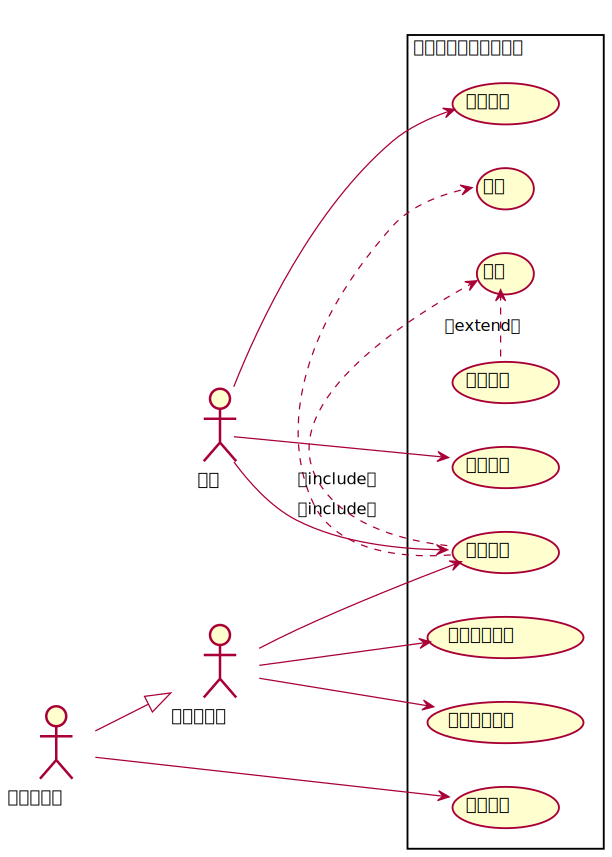

# 实验2：图书管理系统用例建模

| 学号 | 班级 | 姓名 | 照片 |
| :------:| :------: | :------: | :------: |
| 201710414318 | 软件（本）17-3 | 王帆 | 无 |

## 1.图书管理系统的关系图
### 1.1 用例图PlantUML源码如下:

```
@startuml
left to right direction
skinparam packageStyle rectangle
actor 读者
actor 图书管理员
actor 系统维护员
rectangle 图书管理系统的用例图 {
    读者-->(预约图书)
    读者-->(续借图书)
    读者-->(图书信息)
    图书管理员-->(图书信息)
    图书管理员-->(读者信息管理)
    图书管理员-->(图书信息管理)
    系统维护员-->(系统维护)
    系统维护员--|>图书管理员
    (图书信息) .> (借书):《include》
    (图书信息) .> (还书):《include》
    (逾期罚款) .> (还书):《extend》

}
@enduml
```
### 1.2 用例图如下:



## 2.参与者说明:
### 2.1图书管理员
主要职责是:借出图书、归还图书、图书信息管理、读者信息管理
### 2.2读者
主要职责是:图书信息、预约图书、续借图书
### 2.3其他类型用户
主要职责是:系统维护
## 3.用例规约表
### [3.1 "借出图书"用例](https://github.com/Wangfan212/is_analysis/blob/master/test2/usecase1.md)
### [3.2 "归还图书"用例](https://github.com/Wangfan212/is_analysis/blob/master/test2/usecase2.md)
### [3.3 "图书信息管理"用例](https://github.com/Wangfan212/is_analysis/blob/master/test2/usecase3.md)
### [3.4 "维护读者信息"用例](https://github.com/Wangfan212/is_analysis/blob/master/test2/usecase4.md)
### [3.5 "图书信息查询"用例](https://github.com/Wangfan212/is_analysis/blob/master/test2/usecase5.md)
### [3.6 "预定图书"用例](https://github.com/Wangfan212/is_analysis/blob/master/test2/usecase6.md)
### [3.7 "续借图书"用例](https://github.com/Wangfan212/is_analysis/blob/master/test2/usecase7.md)
### [3.8 "修改密码"用例](https://github.com/Wangfan212/is_analysis/blob/master/test2/usecase8.md)