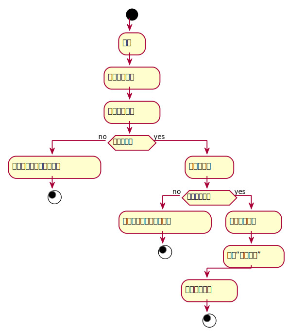

###     3.1 “借出图书”用例
<table>
  <caption align="center">"借出图书"用例规约</caption>
  <tr>
    <td>用例名称</td>
    <td>借出图书</td>
  </tr>
  <tr>
    <td>参与者</td>
    <td>图书管理员</td>
  </tr>
  <tr>
    <td>前置条件</td>
    <td>用户发出借书请求</td>
  </tr>
  <tr>
    <td>后置条件</td>
    <td>更新图书与用户借书记录信息</td>
  </tr>
  <tr>
    <td colspan="2" align="center">主事件流</td>
  </tr>
  <tr>
    <td>参与者动作</td>
    <td>系统行为</td>
  </tr>
  <tr>
    <td>
		1. 获取相应图书<br>
		5. 将相应图书交于用户<br>
		6. 更新用户借阅信息<br>
		7. 更新图书信息<br>
	</td>
    <td>
		2. 传递给管理员相应图书信息<br>
		3. 显示图书借阅情况<br>
		4. 确认图书库存<br>
		8. 将图书信息更新<br>
		9. 对图书归还计时<br>
	</td>
  </tr>
  <tr>
    <td colspan="2" align="center">备选事件流</td>
  </tr>
  <tr>
    <td colspan="2">4a.图书库存已为0<br>5a.提示该图书已被借完，结束用例</td>
  </tr>
  <tr>
    <td colspan="2" align="center">业务规则</td>
  </tr>
  <tr>
    <td colspan="2">1.同一类型图书，有多本，应该有详细的信息记录<br>2.如果该书不存在，或则结束本次借阅</td>
  </tr>
</table>

#### "借出图书"用例流程图PlantUML源码如下：
```
@startuml
start
	:登录;
	:进入借阅页面;
	:输入图书编号;
	if (图书存在？) then (no)
		:输入有误，该图书不存在;
		stop
	else (yes)
		:显示库存量;
	if (库存量充足？) then (no)
		:借书失败，提供库存不足;
		stop
	else (yes)
		:点击借阅按钮;
		:显示“借阅成功”;
	endif
	:借出图书结束;
stop
@enduml
```
#### "借出图书"用例流程图如下：
