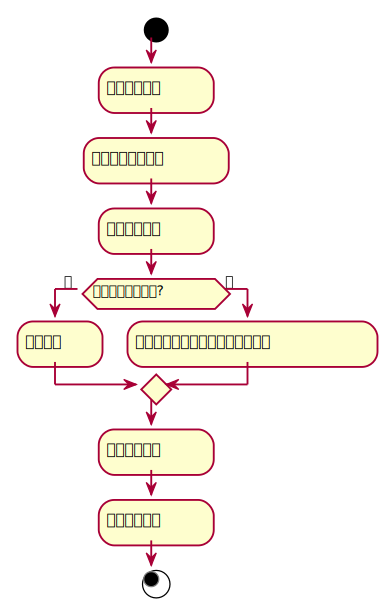

###     3.2 “归还图书”用例
<table>
  <caption align="center">"归还图书"用例规约</caption>
  <tr>
    <td>用例名称</td>
    <td>归还图书</td>
  </tr>
  <tr>
    <td>参与者</td>
    <td>图书管理员</td>
  </tr>
  <tr>
    <td>前置条件</td>
    <td>用户发出还书请求</td>
  </tr>
  <tr>  
    <td>后置条件</td>
    <td>更新图书与用户信息</td>
  </tr>
  <tr>
    <td colspan="2" align="center">主事件流</td>
  </tr>
  <tr>
    <td>参与者动作</td>
    <td>系统行为</td>
  </tr>
  <tr>
    <td>
		1. 获取相应图书<br>
		5. 将相应图书归入入库<br>
		6. 更新用户借阅信息<br>
		7. 更新图书信息<br>
	</td>
    <td>
		2. 传递给管理员相应图书信息<br>
		3. 显示图书借阅情况<br>
		4. 确认图书库存<br>
		8. 将图书信息更新<br>
		9. 对图书借阅时间进行核对<br>
	</td>
  </tr>
  <tr>
    <td colspan="2" align="center">备选事件流</td>
  </tr>
  <tr>
    <td colspan="2">9a.归还时间已逾期<br>1.提示逾期，根据预期时长罚款</td>
  </tr>
  <tr>
    <td colspan="2" align="center">业务规则</td>
  </tr>
  <tr>
    <td colspan="2">1.同一类型图书，有多本，应该有详细的信息记录<br>2.一次借阅图书最长时间为一月，而后根据预期时长罚款</td>
  </tr>
</table>

#### "归还图书"用例流程图PlantUML源码如下：
```
@startuml
start
    :获取图书信息;
    :查看借阅记录信息;
    :获取借书时间;
if (归还日期是否逾期?) then (是)
    :还书成功;
else (否)
    :还书失败，根据预期时长进行罚款;
endif
    :更新图书信息;
    :更新用户信息;
stop
@enduml
```
#### "归还图书"用例流程图如下：
