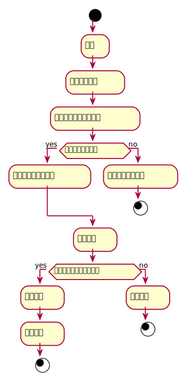

###     3.3 “管理图书信息”用例
<table>
  <caption align="center">"管理图书信目"用例规约</caption>
  <tr>
    <td>用例名称</td>
    <td>管理图书信</td>
  </tr>
  <tr>
    <td>参与者</td>
    <td>图书管理员</td>
  </tr>
  <tr>
    <td>前置条件</td>
    <td>1.成功登陆该系统<br>2.查询图书书目<br>3.选择维护的图书种类<br>4.操作具体的维护信息的表单或相应的操作</td>
  </tr>
  <tr>  
    <td>后置条件</td>
    <td>1.提交维护信息的表单后根据维护的种类在数据库中进行相应的数据表的更新操作<br>2.提示维护书目是否成功<br>3.显示维护书目的具体信息</td>
  </tr>
  <tr>
    <td colspan="2" align="center">主事件流</td>
  </tr>
  <tr>
    <td>参与者动作</td>
    <td>系统行为</td>
  </tr>
  <tr>
    <td>
		1. 管理员做出具体的与之对应的维护书目的操作来维护书目<br>
		3. 点击维护表单的提交按钮<br>
	</td>
    <td>
		2. 系统根据表单传过来的维护信息更新相应的数据库中的表的信息<br>
		4. 返回给管理员对应的提示信息<br>
	</td>
  </tr>
  <tr>
    <td colspan="2" align="center">备选事件流</td>
  </tr>
  <tr>
    <td colspan="2">3a.提示维护信息有误，请核对正确后再提交维护信息，请重新输入<br>3b.显示图书暂时被锁定不能被维护<br>3c.提示暂时禁止维护该图书信息，请稍后重试<br></td>
  </tr>
  <tr>
    <td colspan="2" align="center">业务规则</td>
  </tr>
  <tr>
    <td colspan="2">1.同一类型图书，有多本，应该有详细的信息记录<br>2.图书管理员可以修改相应图书信息</td>
  </tr>
</table>

#### "维护书目"用例流程图PlantUML源码如下：
```
@startuml
start
    :登录;
    :列出所有图书;
    :选择所需要维护的图书;
if(是否有维护图书？) then (yes)
    :显示该图书书目信息;
else (no)
    :提示不存在该图书;
stop
endif
    :维护书目;
if(修改书目信息是否成功？) then (yes)
    :确认信息;
    :更新信息;
    stop
else (no)
    :修改失败;
    stop
@enduml
```
#### "维护书目"用例流程图如下：
