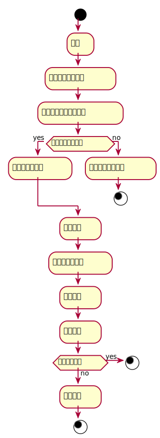

###     3.4 “读者信息管理”用例
<table>
  <caption align="center">"读者信息管理"用例规约</caption>
  <tr>
    <td>用例名称</td>
    <td>读者信息管理</td>
  </tr>
  <tr>
    <td>参与者</td>
    <td>图书管理员</td>
  </tr>
  <tr>
    <td>前置条件</td>
    <td>1.查询出需要维护读者的信息<br>2.填写修改读者信息的表单并提交<br></td>
  </tr>
  <tr>  
    <td>后置条件</td>
    <td>1.修改对应读者的信息，提示管理员维护读者信息成功<br></td>
  </tr>
  <tr>
    <td colspan="2" align="center">主事件流</td>
  </tr>
  <tr>
    <td>参与者动作</td>
    <td>系统行为</td>
  </tr>
  <tr>
    <td>
		1. 图书管理员查询出对应的读者信息<br>
		2. 图书管理员将更新后的读者信息提交给系统<br>
		6. 图书管理员确认读者信息<br>
	</td>
    <td>
		3. 系统根据传入的新的读者信息更新读者表的数据<br>
		4. 系统显示最新的读者信息<br>
		5. 系统提示图书管理员读者信息维护成功<br>
	</td>
  </tr>
  <tr>
    <td colspan="2" align="center">备选事件流</td>
  </tr>
  <tr>
    <td colspan="2">1a.无该读者<br>2a.更新异常，请重试<br>5a.信息维护失败</td>
  </tr>
  <tr>
    <td colspan="2" align="center">业务规则</td>
  </tr>
  <tr>
    <td colspan="2">1.同一类型图书，有多本，应该有详细的信息记录<br>2.管理员可以对读者信息进行修改</td>
  </tr>
</table>

#### "维护读者信息"用例流程图PlantUML源码如下：
```
@startuml
start
    :登录;
    :列出所有读者信息;
    :选择所需要维护的读者;
if(是否有维护读者？) then (yes)
    :显示该读者信息;
else (no)
    :提示不存在该读者;
stop
endif
    :维护读者;
    :填写读者新信息;
    :确认信息;
    :更新信息;
if(更新是否成功) then(yes)
    stop
else (no)
    :更新失败;
    stop
@enduml
```
#### "维护读者信息"用例流程图如下：
