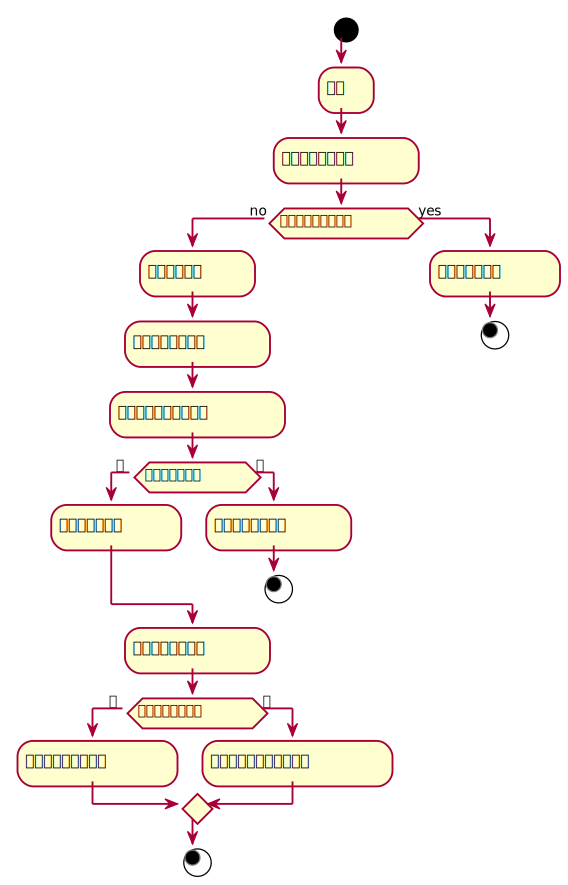

###     3.5 “图书信息查询”用例
<table>
  <caption align="center">"图书信息查询"用例规约</caption>
  <tr>
    <td>用例名称</td>
    <td>图书信息查询</td>
  </tr>
  <tr>
    <td>参与者</td>
    <td>读者</td>
  </tr>
  <tr>
    <td>前置条件</td>
    <td>成功登陆该系统</td>
  </tr>
  <tr>  
    <td>后置条件</td>
    <td>显示出对应查询的书目信</td>
  </tr>
  <tr>
    <td colspan="2" align="center">主事件流</td>
  </tr>
  <tr>
    <td>参与者动作</td>
    <td>系统行为</td>
  </tr>
  <tr>
    <td>
        1.读者可以查看自己的已借书目<br>
		2.读者在搜索框输入想要查询书目信息的图书名字或者图书编号<br>
		3. 点击查询书目的按钮	
	</td>
    <td>
		4. 系统根据穿过来的图书编号或者图书的名字去查询数据库<br>
		5.显示读者对应的书目的各项信息<br>
	</td>
  </tr>
  <tr>
    <td colspan="2" align="center">备选事件流</td>
  </tr>
  <tr>
    <td colspan="2">1a.查询异常<br>2a.输入的图书信息有误<br></td>
  </tr>
  <tr>
    <td colspan="2" align="center">业务规则</td>
  </tr>
  <tr>
    <td colspan="2">1.同一类型图书，有多本，应该有详细的信息记录<br>2.读者可以用过查询来查看书目</td>
  </tr>
</table>

#### "查询书目"用例流程图PlantUML源码如下：
```
@startuml 
start 
    :登录; 
    :选择查询图书按钮;
if(查看自己的借阅情况) then(no)
    :选择查询图书; 
    :列出所有图书信息; 
    :输入所需要查询的图书; 
if(是否有该图书？) then (是) 
    :显示该图书信息; 
else (否) 
    :提示不存在该图书; 
stop 
endif 
    :选择查看书目信息; 
if(是否有书目信息？) then (是) 
    :显示该图书书目信息; 
else (否) 
    :提示该图书没有书目信息; 
endif 
stop
else (yes)
    :展示自己的数目;
stop
@enduml 
```
#### "查询书目信息"用例流程图如下：
