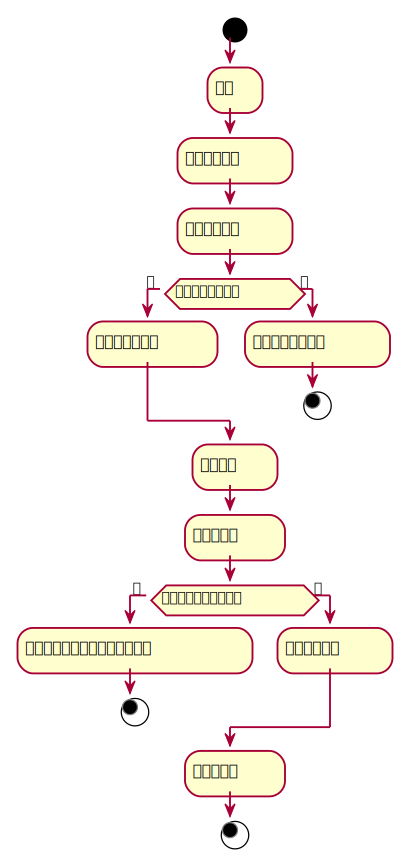

###     3.7 “预约”用例
<table>
  <caption align="center">"预约"用例规约</caption>
  <tr>
    <td>用例名称</td>
    <td>预约</td>
  </tr>
  <tr>
    <td>参与者</td>
    <td>读者</td>
  </tr>
  <tr>
    <td>前置条件</td>
    <td>
    	1.成功登陆该系统<br>
    	2. 预定的图书存在<br>
    	3. 该读者拥有该图书的预定权限<br>
		4. 该读者还有可以预定图书的次数
    </td>
  </tr>
  <tr>  
    <td>后置条件</td>
    <td>
    	1. 点击预定图书后，显示预定图书成功<br>
		2. 为读者绑定一条相应的预定图书的信息<br>
		3. 该图书的预定数加一<br>
		4. 预定的规定时间快结束时，提醒读者前来取书
	</td>
  </tr>
  <tr>
    <td colspan="2" align="center">主事件流</td>
  </tr>
  <tr>
    <td>参与者动作</td>
    <td>系统行为</td>
  </tr>
  <tr>
    <td>
		1.读者在搜索框输入想要预定书目信息的图书名字或者图书编号 <br>
		2.点击预定书目的按钮
	</td>
    <td>
		3.系统根据穿过来的图书编号或者图书的名字以及读者的编号在数据库中新增一条数据用来保存该预定信息和读者之间的联系<br>
		4.显示读者对应的书目的各项信息
	</td>
  </tr>
  <tr>
    <td colspan="2" align="center">备选事件流</td>
  </tr>
  <tr>
    <td colspan="2">
    	1a.无此书的预约权限<br>1.提示预定图书失败<br>
    	2a.输入的图书编号有误<br>1.提示图书编号错误，请重新输入<br>
    	3a.图书名字匹配错误<br>1.提示书名输入错误，请重新输入<br>
    	4a.无剩余的预约次数<br>1.提示预定图书失败<br>
    </td>
  </tr>
  <tr>
    <td colspan="2" align="center">业务规则</td>
  </tr>
  <tr>
    <td colspan="2">1.同一类型图书，有多本，应该有详细的信息记录<br>2.读者可以通过预约来后续借书</td>
  </tr>
</table>

#### "预定图书"用例流程图PlantUML源码如下：
```
@startuml
start
    :登录;
    :列出所有图书;
    :选择预定图书;
if(是否有预定图书？) then (是)
    :显示该图书信息;
else (否)
    :提示不存在此图书;
stop
endif
    :预定图书;
    :填写预定单;
if(该图书是否还有库存？) then (是)
    :图书已全部借出，不能进行预定;
stop
else (否)
    :确认预定信息;
endif
    :保存预定单;
stop
@enduml
```
#### "预定图书"用例流程图如下：
