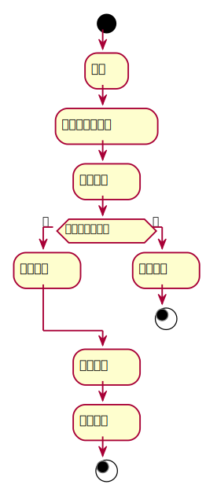

###     3.8 “续借图书”用例
<table>
  <caption align="center">"续借图书"用例规约</caption>
  <tr>
    <td>用例名称</td>
    <td>续借图书</td>
  </tr>
  <tr>
    <td>参与者</td>
    <td>读者</td>
  </tr>
  <tr>
    <td>前置条件</td>
    <td>
    	1.成功登陆该系统<br>
    	2. 存在该图书借阅的信息<br>
    </td>
  </tr>
  <tr>  
    <td>后置条件</td>
    <td>
    	1. 点击续借图书后，显示续借成功<br>
	    2. 增加时长<br>
		3. 该图书的数量不变
	</td>
  </tr>
  <tr>
    <td colspan="2" align="center">主事件流</td>
  </tr>
  <tr>
    <td>参与者动作</td>
    <td>系统行为</td>
  </tr>
  <tr>
    <td>
		1.读者登录该系统 <br>
		2.进入个人中心的已借阅书目 <br>
		3.点击续借按钮
	</td>
    <td>
		4.系统根据穿过来的图书编号或者图书的名字以及读者的编号在数据库中重新修改借阅情况<br>
		5.显示读者续借图书成功
	</td>
  </tr>
  <tr>
    <td colspan="2" align="center">备选事件流</td>
  </tr>
  <tr>
    <td colspan="2">
    	5a.该书已被预订
    </td>
  </tr>
  <tr>
    <td colspan="2" align="center">业务规则</td>
  </tr>
  <tr>
    <td colspan="2">1.同一类型图书，有多本，应该有详细的信息记录<br>2.书籍可以接受续借但是当存在预定时则失败。</td>
  </tr>
</table>

#### "取消预定"用例流程图PlantUML源码如下：
```
@startuml
start
    :登录;
    :进入已借阅数目;
    :选择续借;
if(是否有该预定？) then (是)
    :续借失败;
else (否)
    :续借成功;
stop
endif
    :提示信息;
    :已被预订;
stop
```
#### "取消预定"用例流程图如下：
