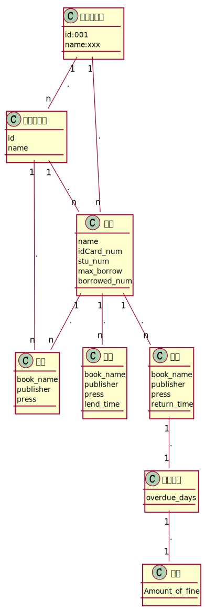
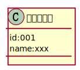
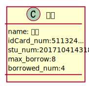
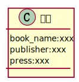
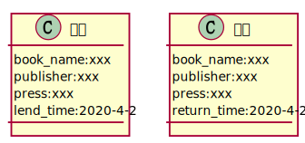
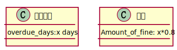

# 实验3：图书管理系统领域对象建模

| 学号 | 班级 | 姓名 | 
| :------:| :------: | :------: | 
| 201710414318 | 17软工3班 | 王帆 |

### 1 图书管理系统领域类图与代码:
#### 1.1 类图源码：

```
@startuml

class 超级管理员{
    id:001
    name:xxx
}
class 图书管理员{
    id
    name
}
class 学生{
    name
    idCard_num
    stu_num
    max_borrow
    borrowed_num
}
class 图书{
    book_name
    publisher
    press
}
class 借书{
    book_name
    publisher
    press
    lend_time
}
class 还书{
    book_name
    publisher
    press
    return_time
}
class 逾期记录{
    overdue_days
}
class 罚款{
    Amount_of_fine
}
超级管理员 "1"--"n" 图书管理员: .
超级管理员 "1"--"n" 学生: .
图书管理员 "1"--"n" 学生 : .
学生 "1"--"n" 借书 : .
学生 "1"--"n" 还书 : .
还书 "1"--"1" 逾期记录 : .
图书管理员 "1"--"n" 图书 :  .
逾期记录 "1"--"1" 罚款 :  .
学生 "1"--"n" 图书 : .

@enduml
```
```
说明： 
    1. 超级管理员可以对应多个图书管理员和多个学生。
    2. 一个管理员可以对应多个学生和多本图书。
    3. 一个学生对应多次借书记录，还书记录，可以借阅多本书籍，也可归还多本书籍。
    4. 一次还书如果逾期则会对应一次逾期记录，同时一次逾期记录优惠对应一次罚款 。
```
#### 1.1.2 图示：



### 2 超级管理员对象图与代码:
#### 2.1 源码：
```
@startuml
class 超级管理员{
    id:001
    name:xxx
}
@enduml
```
#### 2.2 图示：

### 3 图书管理员对象图与代码:
#### 3.1 源码：
```
@startuml
class 图书管理员{
    编号：0001
    姓名：xxx
}
@enduml
```
#### 3.2 图示：

### 4 学生对象图与代码:
#### 4.1 源码：
```
@startuml
class 学生{
    name: 王帆
    idCard_num:511324...
    stu_num:201710414318
    max_borrow:8
    borrowed_num:4
}
@enduml
```
#### 4.2 图示：


### 5 图书对象图与代码:
#### 5.1 源码：

```
@startuml
class 图书{
    book_name:xxx
    publisher:xxx
    press:xxx
}
@enduml
```
#### 5.2 图示：


### 6 借书与还书对象图与代码:
#### 6.1 源码：
```
@startuml
class 借书{
    book_name:xxx
    publisher:xxx
    press:xxx
    lend_time:2020-4-2
}

class 还书{
    book_name:xxx
    publisher:xxx
    press:xxx
    return_time:2020-4-2
}
@enduml
```
#### 6.2 图示：



### 7 逾期记录、罚款对象图与代码:
#### 7.1 源码：
```
@startuml
class 逾期记录{
    overdue_days:x days
}
class 罚款{
    Amount_of_fine: x*0.8
}
@enduml
```
#### 7.2 图示：
