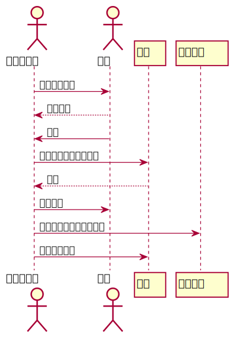

# 实验4：图书管理系统顺序图替换

|  学号  |  班级  |  姓名  | 照片 |
|:---:|:---:|:---:|:---:|
|201710414318|软件17-3|王帆|无

## 图书管理系统的时序图

###  1.借出图书用例

####  1.1借出图书用例PlantUML原始代码

```
@startuml
Actor 图书管理员
Actor 读者
图书管理员->读者:读取读者信息
读者-->图书管理员:读者信息
读者->图书管理员:借书
图书管理员->图书:取读者书籍信息，查询
图书-->图书管理员:可借
图书管理员->读者:借出书籍
图书管理员->借书记录:保存借书信息到借书记录
图书管理员->图书:修改图书状态
@enduml
```

#### 1.2借出图书用例时序图



### 2.归还图书用例

#### 2.1归还图书用例PlantUML原始代码
```
@startuml
Actor 图书管理员
Actor 读者
图书管理员->读者:读取读者信息
读者-->图书管理员:读者信息
读者->图书管理员:还书
图书管理员->借书记录:取读者借书信息，查询
借书记录-->图书管理员:还书信息
图书管理员->图书:修改图书状态
@enduml
```

#### 2.2归还图书用例时序图


### 3.维护书目用例

#### 3.1图书信息管理用例PlantUML原始代码

```
@startuml
actor 图书管理员
图书管理员->图书:读取图书信息
图书-->图书管理员:图书信息

图书管理员->图书:更新图书最新信息
图书-->图书管理员:更新成功
@enduml
```

#### 3.2图书信息管理用例时序图


### 4.维护读者信息用例

#### 4.1维护读者信息PlantUML原始代码

```
@startuml
actor 图书管理员
图书管理员->读者信息:读取读者信息
读者信息-->图书管理员:读者信息

图书管理员->读者信息:更新读者信息
读者信息-->图书管理员:更新成功
@enduml
```

#### 4.2维护读者信息用例时序图


### 5.查询图书用例

#### 5.1查询图书用例PlantUML原始代码

```
@startuml
actor 读者
读者->图书信息:查询书目
图书信息-->读者:书籍信息
@enduml
```

#### 5.2查询图书用例时序图


### 6.预订书籍用例

#### 6.1预订书籍用例PlantUML原始代码

```
@startuml
actor 读者

读者->图书信息:查询图书状态
图书信息-->读者:可借，可预订
读者->图书信息:预订
系统->图书信息:修改图书信息
图书信息-->读者:预订成功况
@enduml
```
#### 6.2预订书籍用例时序图


### 7.续借图书用例

#### 7.1续借图书用例PlantUML原始代码

```
@startuml
actor 读者
actor 图书管理员

读者->图书管理员:续借
图书管理员->借书记录:查询借书记录
图书管理员->图书信息:查询书籍信息
图书信息-->图书管理员:可以续借
图书管理员-->读者:续借成功
图书管理员->图书信息:修改图书信息
图书管理员->借书记录:修改借书记录
@enduml
```

#### 7.2续借图书用例时序图


### 8.修改密码用例

#### 8.1修改密码用例PlantUML原始代码

```
@startuml
actor 读者
读者->读者信息:登录，修改密码
读者信息-->读者:修改成功
@enduml
```

#### 8.2修改密码用例例时序图

