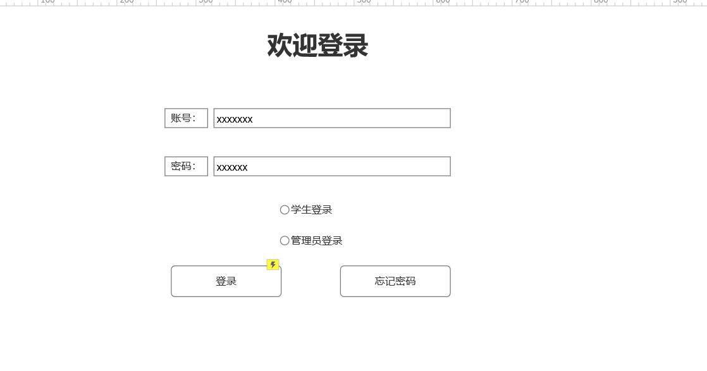
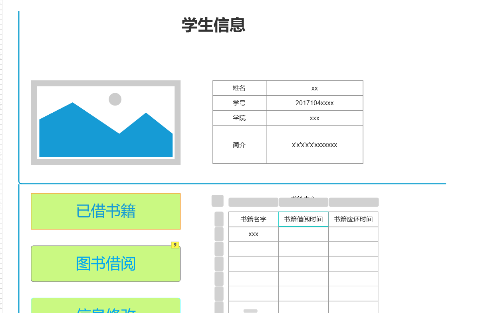
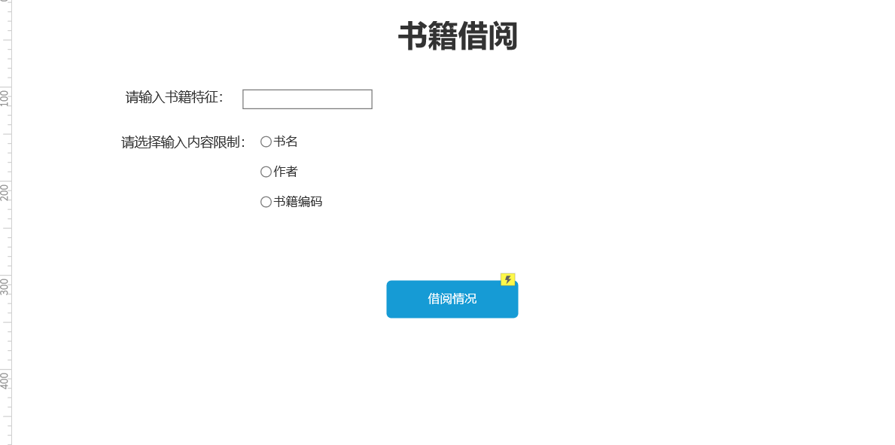

# 实验5：图书管理系统数据库设计与界面设计

| 学号 | 班级 | 姓名 | 照片 |
| :------:| :------: | :------: | :------: |
| 201710414318 | 3 | 王帆 | 无

简介：本实验用于对图书管理系统的数据库设计进行一个说明，以及图书的界面实现跳转等做一个简要说明

## 1.图书管理系统数据库表结构设计
<table>
    <caption cellspacing="0">学生表：</caption>
        <tr>
            <td>字段名</td>
            <td>数据类型</td>
            <td>是否为空/性质</td>
            <td>说明</td>
        </tr>
    <tr>
        <td>stu_id</td>
        <td>varchar</td>
        <td>not null</td>
        <td>学生学号，设置为主键</td>
        </tr>
    <tr>
        <td>stu_name</td>
        <td>varchar</td>
        <td>not null</td>
        <td>学生姓名</td>
    </tr>
    <tr>
        <td>stu_tel</td>
        <td>varchar</td>
        <td>not null</td>
        <td>学生电话</td>
    </tr>
    <tr>
        <td>stu_le</td>
        <td>int</td>
        <td>not null</td>
        <td>学生可借书籍数</td>
    </tr>
</table>

<table>
  <caption cellspacing="0">书籍表：</caption>
  <tr>
    <td>字段名</td>
    <td>数据类型</td>
    <td>是否为空/性质</td>
    <td>说明</td>
  </tr>
  <tr>
    <td>book_id</td>
    <td>varchar</td>
    <td>not null</td>
    <td>书籍号，主键</td>
  </tr>
  <tr>
    <td>book_name</td>
    <td>varchar</td>
    <td>not null</td>
    <td>书籍名称</td>
  </tr>
  <tr>
    <td>book_author</td>
    <td>varchar</td>
    <td>not null</td>
    <td>作者名字</td>
  </tr>
<tr>
    <td>book_pub</td>
    <td>varchar</td>
    <td>not null</td>
    <td>出版社</td>
  </tr>
<tr>
    <td>book_le</td>
    <td>int</td>
    <td>not null</td>
    <td>书籍余量</td>
  </tr>
</table>

<table>
  <caption cellspacing="0">借书表：</caption>
  <tr>
    <td>字段名</td>
    <td>数据类型</td>
    <td>是否为空/性质</td>
    <td>说明</td>
  </tr>
<tr>
    <td>stu_id</td>
    <td>varchar</td>
    <td>not null</td>
    <td>学生学号，主键</td>
  </tr>
  <tr>
    <td>book_id</td>
    <td>varchar</td>
    <td>not null/PK</td>
    <td>书籍编号，外键</td>
  </tr>
  <tr>
    <td>borrow_date</td>
    <td>datatime</td>
    <td>null</td>
    <td>借书时间</td>
  </tr>
</table>


<table>
  <caption cellspacing="0">return：</caption>
  <tr>
    <td>字段名</td>
    <td>数据类型</td>
    <td>是否为空/性质</td>
    <td>说明</td>
  </tr>
<tr>
    <td>stu_id</td>
    <td>varchar</td>
    <td>not null</td>
    <td>学生学号，主键</td>
  </tr>
  <tr>
    <td>book_id</td>
    <td>varchar</td>
    <td>not null</td>
    <td>书籍编号，外键</td>
  </tr>
  <tr>
    <td>borrow_date</td>
    <td>datatime</td>
    <td>null</td>
    <td>借书时间</td>
  </tr>
<tr>
    <td>return_date</td>
    <td>datatime</td>
    <td>null</td>
    <td>还书时间</td>
  </tr>
</table>

<table>
  <caption cellspacing="0">书籍归还逾期表：</caption>
  <tr>
    <td>字段名</td>
    <td>数据类型</td>
    <td>是否为空/性质</td>
    <td>说明</td>
  </tr>
<tr>
    <td>stu_id</td>
    <td>varchar</td>
    <td>not null</td>
    <td>学生学号，主键</td>
  </tr>
  <tr>
    <td>book_id</td>
    <td>varchar</td>
    <td>not null</td>
    <td>书籍编号，外键</td>
  </tr>
  <tr>
    <td>over_date</td>
    <td>int</td>
    <td>null</td>
    <td>逾期天数</td>
  </tr>
<tr>
    <td>ticket_fee</td>
    <td>float</td>
    <td>null</td>
    <td>罚金</td>
  </tr>
</table>


<table>
  <caption cellspacing="0">管理员表：</caption>
  <tr>
    <td>字段名</td>
    <td>数据类型</td>
    <td>是否为空/性质</td>
    <td>说明</td>
  </tr>
  <tr>
    <td>manager_id</td>
    <td>varchar</td>
    <td>not nullK</td>
    <td>管理员编号，主键</td>
  </tr>
  <tr>
    <td>manager_name</td>
    <td>varchar</td>
    <td>not null</td>
    <td>管理员姓名</td>
  </tr>
  <tr>
    <td>manager_age</td>
    <td>int</td>
    <td>not null</td>
    <td>管理员年龄</td>
  </tr>
<tr>
    <td>manager_tel</td>
    <td>varchar</td>
    <td>not null</td>
    <td>管理员电话</td>
  </tr>
</table>

## 2.借书界面设计:
介绍：关于界面的设计我就只对登录，学生个人信息，和借书界面进行了设计
### 2.1登录

### 2.2学生信息界面

### 2.3借书界面

## 3.api
### 3.1 登录页面验证账户是否存在

请求地址： http://..../api/checking

请求方法：POST

请求参数：
<table>
  <tr>
    <td>参数名称</td>
    <td>必填</td>
    <td>说明</td>
  </tr>
  <tr>
    <td>account</td>
    <td>是</td>
    <td>学号</td>
  </tr>
  <tr>
    <td>action</td>
    <td>是</td>
    <td>固定为 “checkAccount”</td>
  </tr>
  <tr>
    <td>access_token</td>
    <td>是</td>
    <td>用于验证请求合法性的认证信息</td>
  </tr>
<tr>
    <td>method</td>
    <td>是</td>
    <td>固定为 “GET”</td>
  </tr>
</table>

### 3.2 学生信息获取书籍与学生信息
请求地址： http://..../api/inf

请求方法：POST
		
请求参数：
<table>
  <tr>
    <td>参数名称</td>
    <td>必填</td>
    <td>说明</td>
  </tr>
  <tr>
    <td>account</td>
    <td>是</td>
    <td>书籍名称</td>
  </tr>
  <tr>
    <td>access_token</td>
    <td>是</td>
    <td>用于验证请求合法性的认证信息</td>
  </tr>
<tr>
    <td>method</td>
    <td>是</td>
    <td>固定为 “GET”</td>
  </tr>
</table>

返回示例：
```
{    
    "data":[{"book_id":"1","book_name":"1","book_author":"1","book_pub":"1", "book_le":"1"}
    ，{"stu_id":"1","stu_name":"2"}],
    "code":200
}
```
返回参数说明：
<table>
  <tr>
    <td>参数名称</td>
    <td>说明</td>
  </tr>
  <tr>
    <td>data</td>
    <td>返回参数数据主体<br>书籍的列表<br>book_id:图书编号<br>book_name:图书名称<br>book_author:作者<br>book_pub:出版社<br>book_le:图书余量</td>
  </tr>
<tr>
    <td>code</td>
    <td>返回码</td>
  </tr>
</table>

### 3.3 借书页面获取书籍信息

请求地址： http://..../api/inf

请求方法：POST
		
请求参数：
<table>
  <tr>
    <td>参数名称</td>
    <td>必填</td>
    <td>说明</td>
  </tr>
  <tr>
    <td>access_token</td>
    <td>是</td>
    <td>用于验证请求合法性的认证信息</td>
  </tr>
<tr>
    <td>method</td>
    <td>是</td>
    <td>固定为 “GET”</td>
  </tr>
</table>

返回示例：
```
{    
    "data":[{"book_id":"1", "book_name":"1","book_author":"1","stu_id":"1", "borrow_data":"1",}], 
    "code":200
    
}
```
返回参数说明：
<table>
  <tr>
    <td>参数名称</td>
    <td>说明</td>
  </tr>
  <tr>
    <td>data</td>
    <td>返回参数数据主体<br>书籍的列表<br>book_id:图书编号<br>book_name:图书名称<br>book_author:作者<br>stu_id:学生学号<br>borrow_data:借书日期</td>
  </tr>
<tr>
    <td>code</td>
    <td>返回码</td>
  </tr>
</table>

## 4.超链接
#### 界面链接：
 [html](https://github.com/Wangfan212/is_analysis_pages/blob/master/start_with_pages.html) <br>我不知道对不对 。。。。

