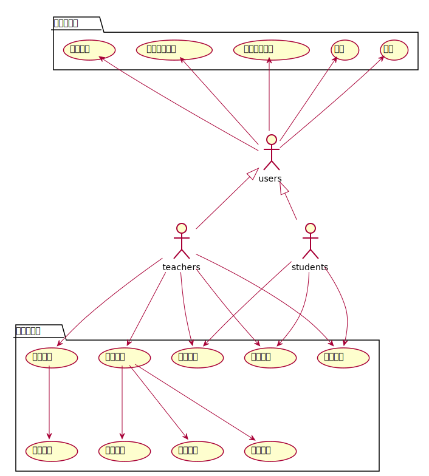
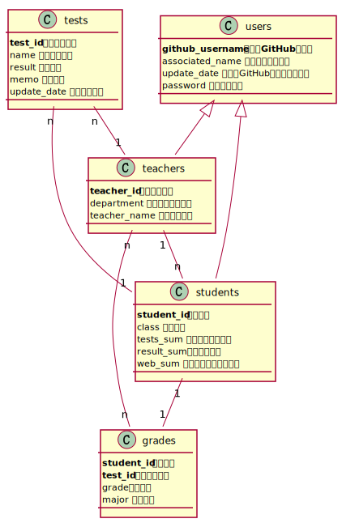

# 实验6：基于GitHub的实验管理平台的分析与设计

| 学号 | 班级 | 姓名 | 
| :------:| :------: | :------: | 
| 201710414318 | 软件（本）17-3 | 王帆 |

## 1. 概述
+ 基于GitHub的实验管理平台，老师和学生可以通过该平台使老师和学生的事务更加方便。
+ 在老师端，老师可以通过该平台来管理学生，和对学生的成绩做出评价。
+ 学生端，学生可以通过该端来提交自己的作业以及查看自己的分数。

## 2.页面结构和跳转设计
界面设计参见： is_analysis_page_1: <https://github.com/Wangfan212/is_analysis_pages_1/blob/master/index.html>

## 3.用例图设计

### [源码](https://github.com/Wangfan212/is_analysis/blob/master/test6/yongli.md)

### 说明：
+ 学生和老师在这样的情况下都是拥有了一些共同的属性，所以可以用一个包来囊括共有的属性。
+ 但是其他不同的属性可以采用对应的方式来进行说明。

## 4.类图设计

### [源码](https://github.com/Wangfan212/is_analysis/blob/master/test6/class.md)

### 说明：
+ 老师和学生同属于user类；
+ 每个类具有自己的属性；
+ 老师可以有多个学生；
+ 多个老师管理多个年级，因为一个老师可能同时对几个年级的学生进行管理，一个年级中也有多个老师；
+ 学生只有一个年级；
+ 一个年级中有多个实验。
+ 同时一个老师负责多份实验

## 5.数据库设计

    

- ## USERS表（用户表）

| 字段 | 类型 | 主键，外键 | 是否为空 | 默认值 | 约束 |  说明 | 
| :------:| :------: | :------: |  :------:| :------: | :-----: | :----------|
|USER_ID|NUMBER(8,0)|主键|否| &nbsp;| &nbsp;| 用户ID|
|associated_name |VARCHAR2(50 BYTE)|&nbsp; |否| &nbsp;| &nbsp;| 用户真实姓名|
|GITHUB_USERNAME|VARCHAR2(50 BYTE)|&nbsp; |是|空|&nbsp; | GitHUB用户名|
|UPDATE_DATE|DATE|&nbsp; |是|空| &nbsp;| GitHUB用户名修改日期|
|PASSWORD|VARCHAR2(512 BYTE)| &nbsp;|是|空|&nbsp; | 加密存储密码，为空表示密码就是学号|
|DISABLE|VARCHAR2(20 BYTE)|  &nbsp;|否|  &nbsp;|  &nbsp;|是否禁用,值为是表示禁用,其他表示正常.|

- ## TEACHERS表（老师表）

| 字段 | 类型 | 主键，外键 | 可以为空 | 默认值 |约束|说明|
|:-------:|:-------------:|:------:|:----:|:---:|:----:|:----------|
|TEACHER_ID|VARCHAR2(50 BYTE)|主键|否| &nbsp; | &nbsp; | 老师的编号|
|USER_ID|NUMBER(8,0)|外键|是| &nbsp; | &nbsp; | 老师的用户ID，USERS表的外键|
|DEPARTMENT|VARCHAR2(400 BYTE)| &nbsp; |否| &nbsp; |  &nbsp;| 老师属于的部门|
|TEACHER_NAME|VARCHAR2(50 BYTE)|&nbsp; |否| &nbsp;| &nbsp;| 老师姓名|

- ## STUDENTS表（学生表）

 |字段|类型|主键，外键|可以为空|默认值|约束|说明|
|:-------:|:-------------:|:------:|:----:|:---:|:----:|:----------|
|STUDENT_ID|VARCHAR2(50 BYTE)|主键|否| &nbsp; | &nbsp; | 学生的学号|
 |USER_ID|NUMBER(8,0)|外键|是| &nbsp; |空| 学生的用户ID，USERS表的外键，为空表示还没有建立用户| 
 |MAJOR|VARCHAR2(20 BYTE)| &nbsp; |否|  &nbsp;| &nbsp; |学生的专业|   
|CLASSNUM|VARCHAR2(20 BYTE)|  &nbsp;|否|  &nbsp;|  &nbsp;|学生的班级号|
|RESULT_SUM|VARCHAR2(400 BYTE)|外键|是|空| &nbsp; | 学生的每次实验成绩（来自TESTS表），记录学生的每次成绩，用逗号来分割开。|
|RESULT_SUM|VARCHAR2(400 BYTE)|外键|是|空| &nbsp; | 成绩汇总（来自GRADES表），以逗号分开，第一个成绩是平均成绩,后面是每次实验的成绩，N表示未批改，平均分只计算已批改的。比如：“81.25,70,80,85,90,N”表示一共批改了4次，第5次未批改，4次的成绩分别是81.25,70,80,85,90,N，4次的平均分是81.25|
|WEB_SUM|VARCHAR2(400 BYTE)|  &nbsp;|是|空| &nbsp; | GitHub网址是否正确，用逗号分开，Y代表正确，N代表不正确。第1位代表总的GitHUB地址是否正确，第2位表示第1次实验的地址，第3位表示第2位实验地址，依此类推。比如：“Y,Y,Y,Y,Y,N”表示第5次实验地址不正确，其他地址正确|

- ## GRADES表（学生实验成绩表）

|字段|类型|主键，外键|可以为空|默认值|约束|说明|
|:-------:|:-------------:|:------:|:----:|:---:|:----:|:----------|
|STUDENT_ID|VARCHAR2(50 BYTE)|联合主键1，外键|否| &nbsp; | &nbsp; | 学生的学号，STUDENTS表外键|
|TEST_ID|NUMBER(6,0)|联合主键2，外键|否|  &nbsp;|  &nbsp;| 实验编号，TESTS表的外键|
|grade|NUMBER(6,0)|否|否|  &nbsp;|  &nbsp;| 哪个年级|

- ## TESTS表（实验项目表）

|字段|类型|主键，外键|可以为空|默认值|约束|说明|
|:-------:|:-------------:|:------:|:----:|:---:|:----:|:----------|
|TEST_ID|NUMBER(6,0)|主键|否|  &nbsp;| &nbsp; | 实验编号|
|TITLE|VARCHAR2(100 BYTE)|  &nbsp;|否|  &nbsp;| &nbsp; | 实验名称|
|RESULT|NUMBER|主键|是|空| 取值0-100| 分数，这个值为空表示没有批改|
|MEMO|VARCHAR2(400 BYTE)| &nbsp; |是|空|  &nbsp;| 老师对实验的评语|
|UPDATE_DATE|DATE|  &nbsp;|是|空| &nbsp; |老师批改实验的日期，为空表示未批改|

## 6.用例及界面详细设计

### [6.1 “学生列表”用例，](https://github.com/Wangfan212/is_analysis/blob/master/test6/students_list.md) [界面](https://github.com/Wangfan212/is_analysis_pages_1/blob/master/%E5%AD%A6%E7%94%9F%E7%AE%A1%E7%90%86.html)

### [6.2 “评定成绩”用例，](https://github.com/Wangfan212/is_analysis/blob/master/test6/grades_judgments.md) [界面](https://github.com/Wangfan212/is_analysis_pages_1/blob/master/%E4%BD%9C%E4%B8%9A%E6%89%B9%E6%94%B9.html)

### [6.3 “查看成绩”用例，](https://github.com/Wangfan212/is_analysis/blob/master/test6/grades.md) [界面](https://github.com/Wangfan212/is_analysis_pages_1/blob/master/%E6%9F%A5%E7%9C%8B%E6%88%90%E7%BB%A9.html)

### [6.4 “修改密码”用例，](https://github.com/Wangfan212/is_analysis/blob/master/test6/rechange_password.md) [界面](https://github.com/Wangfan212/is_analysis_pages_1/blob/master/%E4%B8%AA%E4%BA%BA%E4%BF%A1%E6%81%AF%E4%BF%AE%E6%94%B9.html)

### [6.5 “修改用户信息”用例，](https://github.com/Wangfan212/is_analysis/blob/master/test6/rechange_info.md) [界面](https://github.com/Wangfan212/is_analysis_pages_1/blob/master/%E4%B8%AA%E4%BA%BA%E4%BF%A1%E6%81%AF%E4%BF%AE%E6%94%B9.html)

### [6.6 “查看用户信息”用例，](https://github.com/Wangfan212/is_analysis/blob/master/test6/inquiry_info.md) [界面](https://github.com/Wangfan212/is_analysis_pages_1/blob/master/%E5%AD%A6%E7%94%9F%E7%AE%A1%E7%90%86.html)

### [6.7 “登录”用例，](https://github.com/Wangfan212/is_analysis/blob/master/test6/login.md) [界面](https://github.com/Wangfan212/is_analysis_pages_1/blob/master/index.html)

### [6.8 “登出”用例，](https://github.com/Wangfan212/is_analysis/blob/master/test6/logout.md) [界面](https://github.com/Wangfan212/is_analysis_pages_1/blob/master/%E7%99%BB%E5%87%BA.html)
