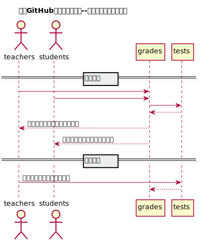

# “查看成绩”用例 [返回](https://github.com/Wangfan212/is_analysis/blob/master/test6/README.md)
## 1. 用例规约

|用例名称|查看成绩|
|-------|:-------------|
|功能|学生查看自己的每个实验的实验成绩及实验评价|
|参与者|学生|
|前置条件|学生需要先登录|
|后置条件| &nbsp; |
|主事件流|  &nbsp;|
|备选事件流|  &nbsp;|

## 2. 业务流程（顺序图）

### [源码](https://github.com/Wangfan212/is_analysis/blob/master/test6/sequence/grades.md)

 

## 3. 接口设计
  
### [详情](https://github.com/Wangfan212/is_analysis/blob/master/test6/api/api3.md)

## 4. 算法描述
    无
    
## 5. 参照表

+ 参照上一页中的数据库设计中的 students、grades、tests。