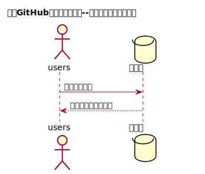

# “查看用户信息”用例 [返回](https://github.com/Wangfan212/is_analysis/blob/master/test6/README.md)
## 1. 用例规约

|用例名称|查看用户信息|
|-------|:-------------|
|功能|查看用户的所有信息|
|参与者|学生，老师|
|前置条件|必须先登录|
|后置条件| &nbsp;|
|主事件流| &nbsp;|
|备选事件流|&nbsp; |

## 2. 业务流程

### [源码](https://github.com/Wangfan212/is_analysis/blob/master/test6/sequence/inquiry_info.md)

## 3. 接口设计

### [详情](https://github.com/Wangfan212/is_analysis/blob/master/test6/api/api6.md)

## 4. 算法描述
无
    
## 5. 参照表

 + 参照上一页中的数据库设计中的 user、students、teachers。