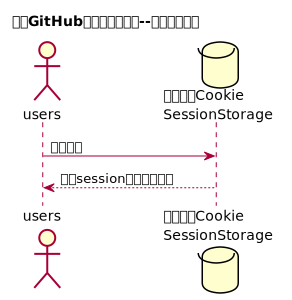

# “登出”用例 [返回](https://github.com/Wangfan212/is_analysis/blob/master/test6/README.md)

## 1. 用例规约

|用例名称|登出|
|-------|:-------------|
|功能|用户登出平台|
|参与者|学生/老师|
|前置条件| |
|后置条件|登出后，跳转到登录页面|
|主事件流| 1. 系统清除客户端登录信息（Cookie）|
|备选事件流|1a. 如果用户登录之后，长时间不超作界面，导致Cookie失效  &nbsp;&nbsp; 1.系统清除客户端登录信息（Cookie|

## 2. 业务流程

### [源码](https://github.com/Wangfan212/is_analysis/blob/master/test6/sequence/logout.md)

## 3. 接口设计

### [详情](https://github.com/Chen-ruiqi123/is_analysis/blob/master/test6/api/api8.md)

## 4. 算法描述

无

## 5. 参照表

 + 参照上一页中的数据库设计中的 users。