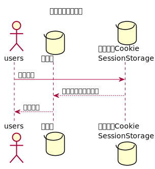
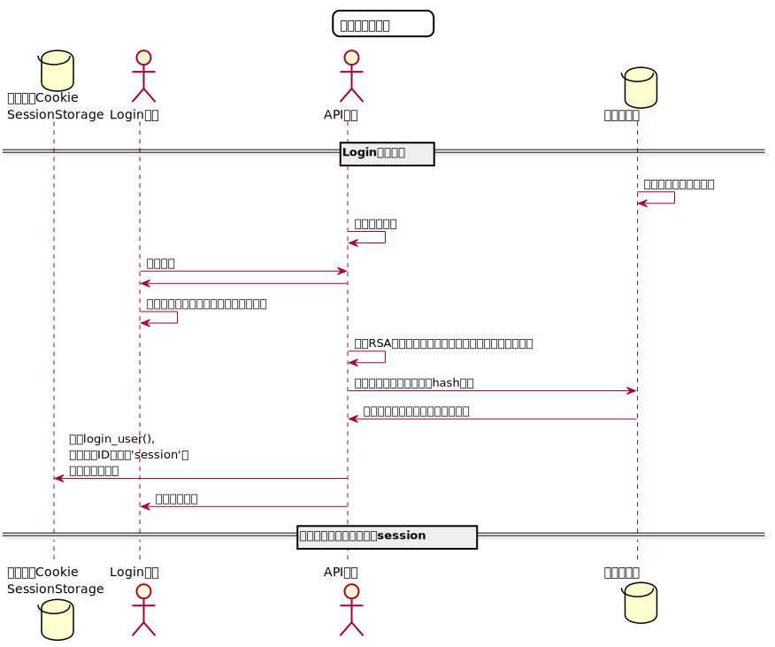

# “修改密码”用例 [返回](https://github.com/Wangfan212/is_analysis/blob/master/test6/README.md)
## 1. 用例规约

|用例名称|修改密码|
|-------|:-------------|
|功能|修改用户的密码|
|参与者|学生，老师|
|前置条件|必须先登录|
|后置条件|修改密码以后必须强制登出，再跳转到登录页面|
|主事件流| 1.用户填写新密码   2.用户提交修改信息  3.系统存储修改后密码|
|备选事件流|1a. 用户两次输入的密码不同  &nbsp;&nbsp; 1.系统提示两次输入的密码不相同   &nbsp;&nbsp; 2. 用户重新填写并提交。 |

## 2. 业务流程

### [源码](https://github.com/Wangfan212/is_analysis/blob/master/test6/sequence/rechange_password.md)

## 3. 接口设计

### [详情](https://github.com/Wangfan212/is_analysis/blob/master/test6/api/api4.md)

## 4. 算法描述 

### [源码](https://github.com/Wangfan212/is_analysis/blob/master/test6/sequence/login_check.md)

    
## 5. 参照表

+ 参照上一页中的数据库设计中的 users。